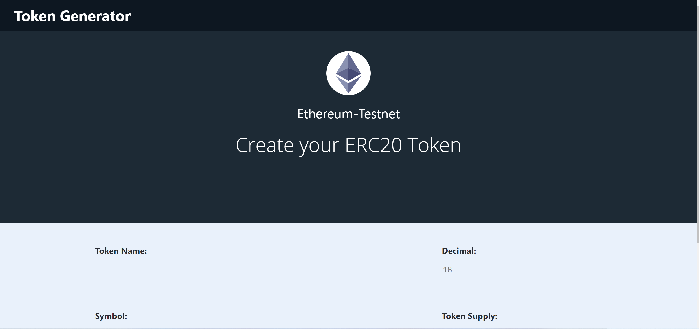
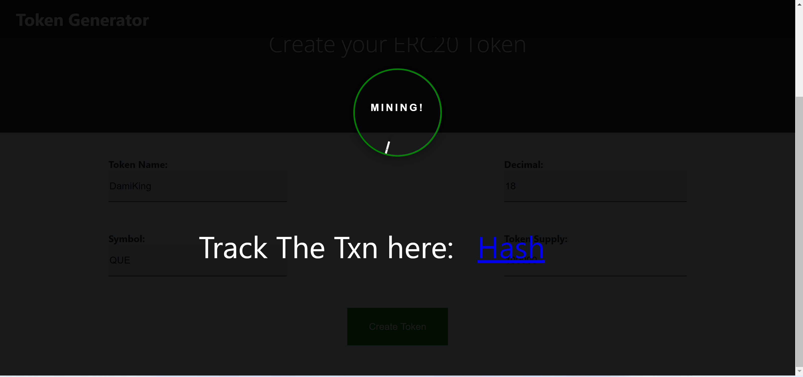
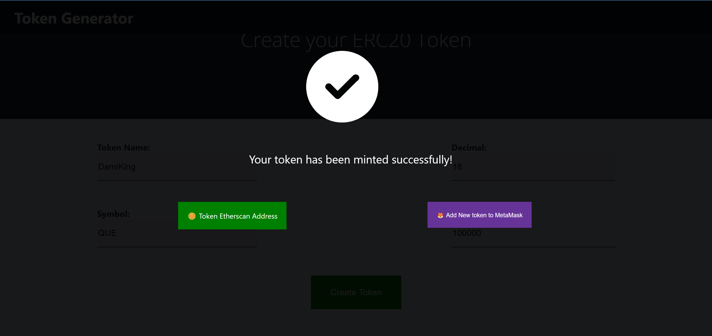

# Simple Token Maker
## This is a simple app that helps users without a knowledge or coding skills to build an ERC20 based token
___
___
### Formpage to fill token details

____
### Overlay showing token txn getting mined and a link to track the transaction on Etherscan

____
### Success page showing the token address and a link to view the token on Etherscan

### Live and Deployed to Firebase, You can try the Token Generator website [here](https://tokengenerator-1.web.app/)

### Token details needed:
> * - Token Name
> * - Token Total Supply
> * - Token Symbol
> * - Decimal (Advisably, leave it as 18)

### App Features:
> * - Multi-Wallet Feature, not stock to Metamask Alone!
> * - Responsive app
> * - Nice and simple Interface
> * - Interactive as you can easily track the mining
> * - Ability to add newly deployed token to wallet

--------------------------------------------
Thank you and Check back for more awesome apps!